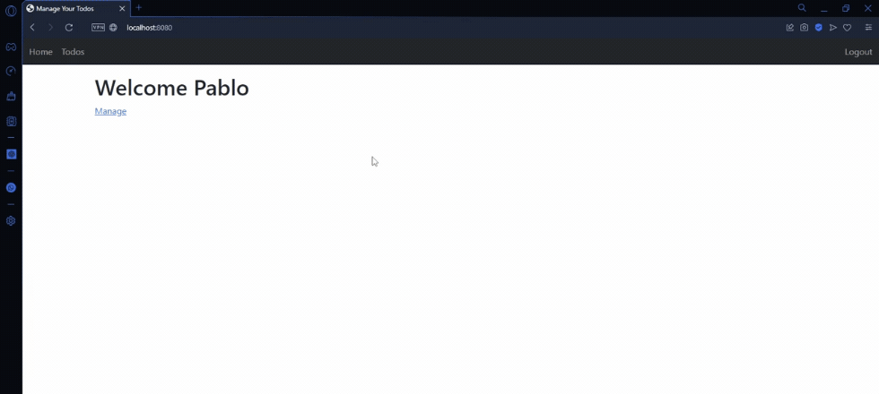
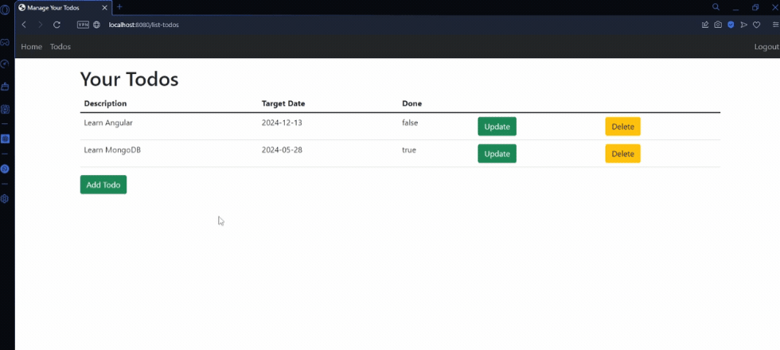
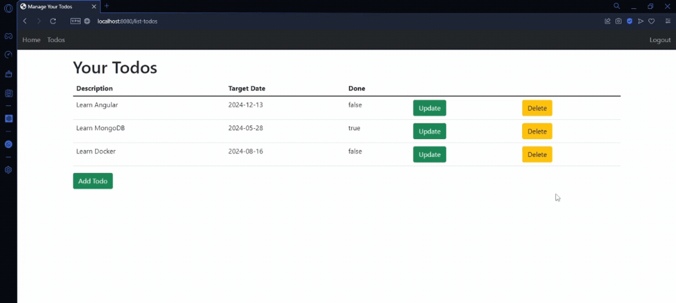
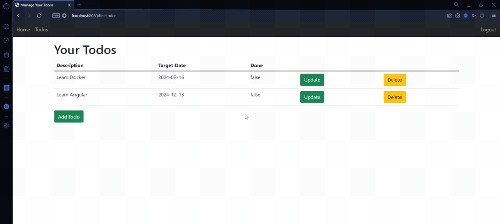
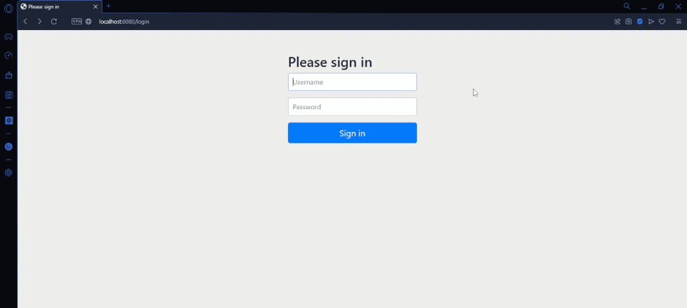

# Todo Web Application - Web App with Spring

This learning project, inspired by the Udemy course [Master Spring Boot 3 & Spring Framework 6 with Java](https://www.udemy.com/course/spring-boot-and-spring-framework-tutorial-for-beginners/), demonstrates the core concepts of Spring Boot, Spring Framework, Spring Security, and Spring Data JPA in the development of a basic web application.

### Prerequisites

To use this project, you need to have knowledge of:

+ Java - Object Oriented Programming Language.
+ Spring Boot - Create stand-alone Spring applications.

### Installing the Project

To download this project, run the following command down below.

```
git clone https://github.com/JuanPablo70/TodoWebApp.git
```

### About this Project

This project is a web application for managing tasks (TODOS) that allows users to add, delete, and update their tasks. Each task has the following attributes:

+ Description: Details of the task.

+ Target Date: Deadline for completing the task.

+ Done: Status indicating whether the task is finished.

The web application was developed using Spring and Spring Framework. Two controllers were implemented to handle redirection between the pages, HomeController to handle home page requests and TodoController to handle todos requests, which are developed in JSP.



#### Features:

+ Add Todos: Allows users to create new tasks with a description, target date, and completion status.

    

+ Delete Todos: Enables users to delete existing tasks.

    

+ Update Tasks: Provides options to modify the description, target date, and status of the tasks.

    

#### Security:

Spring Security was used for user authentication. The security configuration is defined in the ***SpringSecurityConfiguration.java*** file, where credentials can be modified if necessary.



#### Data Storage:

Task information is stored in an in-memory H2 database. However, the application is also configured to connect to a persistent database if required.

### Build With

+ [Spring Initializr](https://start.spring.io) - Tool used to set up Spring Boot projects.
+ [Maven](https://maven.apache.org) - Software project management and comprehension tool.
+ [Bootstrap](https://getbootstrap.com) - Powerful, extensible, and feature-packed frontend toolkit.

### Version

1.0

### Author

[Juan Pablo Sánchez Bermúdez](https://github.com/JuanPablo70)